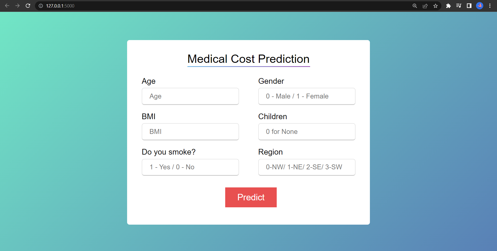
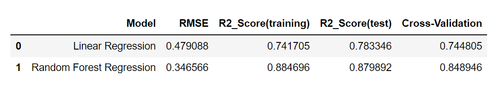

<h1>Medical Insurance Cost Prediction</h1>

This project aims to predict the insurance charge of a person given his information including- age, gender, bmi, number of childrens, smoker status and region using a machine learning algorithm (Random Forest Regression).

## Link to Site
You can visit the website [Link](https://costs.herokuapp.com/)

## Home Page

## Requirements
1. A machine with Python 3 installed.
2. The following packages are needed to be installed for this project to run:
    - numpy
    - matplotlib
    - scikit-learn
    - flask

## How to use
1. Install dependencies with `pip install -r requirements.txt`
2. Run `python app.py`

## Dataset
The dataset used can be downloaded from (Kaggle) - [Click to Download](https://www.kaggle.com/mirichoi0218/insurance)

## Model used
1. Linear Regression
2. Random Forest Regression

## Performance measure

From this it can be clear that Random Forest Regression is having less RMSE value than Linear Regression and high cross validation value, hence it is considered to be the best model.

## Results
####  Model gave 86% accuracy for Medical Insurance Cost Prediction using <code>Random Forest Regression.</code>